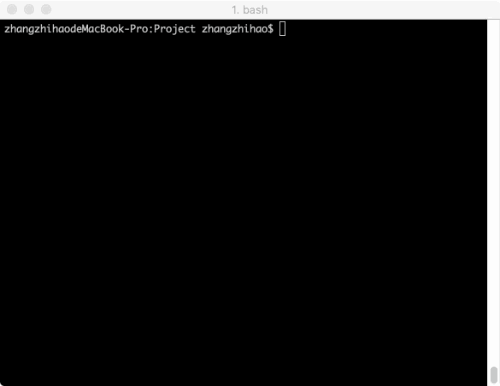
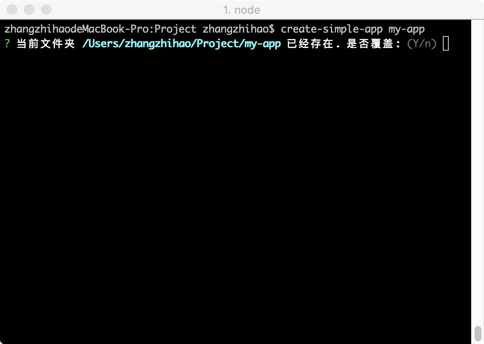

# create-simple-app 

[](https://travis-ci.org/rywaroy/create-simple-app)

> 快速创建简单应用

## 简介

`create-simple-app`是一款能快速生成webpack配置的小工具。

平时经常写些demo，但是碍于`vue-cli` `create-react-app` `umi`过于庞大，自己复制`webpack.config.js`又太繁琐，就写了这个可以自由搭配选择功能，自动生成配置文件，顺带抄了一手`vue-cli3`有交互式选择功能，插件机制的工具。



## 安装

```
yarn global add create-simple-app
```

## 使用

```
create-simple-app my-app
```

或者

```
cd my-app
```

```
create-simple-app
```

2种构建方式，第一种会在当前文件夹下创建my-app文件夹，如果my-app文件夹已经存在，会提示是否覆盖my-app文件夹



第二种不设置目标文件夹，则会在当前目录下创建配置文件

> 如果当前目录一下已经存在项目（判断目录下是否有package.json）会进入 `添加配置模式`，提供部分配置对原有的package.json 进行改造添加

### 支持的功能

* Babel

  在package.json中添加babel配置，如果选择了vue react typescript 则会添加对应插件

* Css

  支持less 和 postcss, 添加`postcss.config.js`配置文件， 会在webpack.config.js中添加 `css-loader` `less-loader` `postcss-loader` 以及分离css的`mini-css-extract-plugin`插件

* Eslint

  支持airbnb规范，如果选择了vue react typescript 则会添加对应eslint配置

* Stylelint

  支持stylelint-config-standard规范，添加`.stylelintrc`配置

* Prettier

* file-loader

  会在webpack.config.js中添加 `file-loader` 解析图片、字体资源

* Jest

  生成`jest.config.js`配置，如果选择了vue react typescript 则会添加对应配置

* React

  添加对应的babel支持，`react` `react-dom`依赖

* TypeScript

  添加`tsconfig.json`配置

* Vue

  添加对应的babel支持，`vue` `vuex` `vue-router`依赖

* lint-staged

  如果添加了`stylelint` `prettier` `eslint`配置，会添加对应的工作流程

* commitlint

* husky

  如果添加了 `lint-staged` 则会添加 `pre-commit` 钩子。如果添加了 `commitlint` 则会添加 `commit-msg` 钩子。 

### API

`create(project?, promptResult?)`

* 参数

  * project - 项目名称
  * promptResult - 指定的inquirer配置，如果设置将跳过inquirer

* 返回值

  * Generator 实例

```js
import { create } from 'create-simple-app';

const generator = create();

generator.create();
```

`add(project?, promptResult?)`

* 参数

  * project - 项目名称
  * promptResult - 指定的inquirer配置，如果设置将跳过inquirer

* 返回值

  * Generator 实例

```js
import { add } from 'create-simple-app';

const generator = add();

generator.create();
```